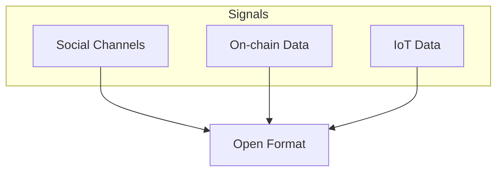

# Monitor

Monitoring signals is where everything begins. We use AI agents to watch on-chain data, social channels, and user feedback, making sure no important signal goes unnoticed. 
These agents identify potential needs, opportunities, or problems — anything from a bug in the codebase to requests for new features. Meanwhile, a reference to a relevant action 
is stored on a public ledger, creating a transparent record of who did what and when. The goal here is to maintain constant awareness of the ecosystem, so that nothing 
slips through the cracks and participants can react to real-time community demands.

