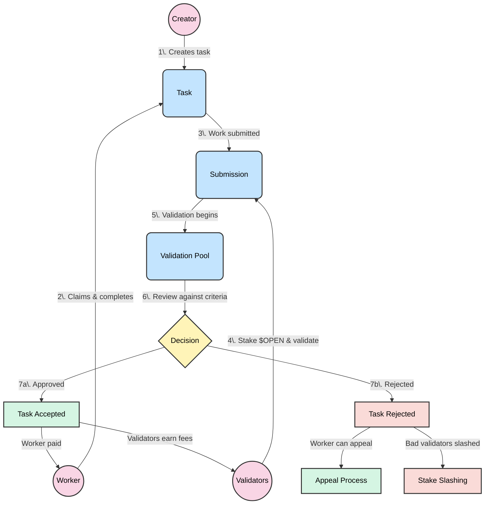

## Task Validation Process

After tasks are defined, the next critical step in the Open Format ecosystem is validation. Similar to proof of stake mechanisms in blockchain networks, validators must stake $OPEN tokens to participate in the validation process.

### Validation Flow

1. **Task Creation**: A Creator defines a task with clear criteria and reward
2. **Task Claiming**: A Worker claims and completes the task
3. **Submission**: The Worker submits their completed work
4. **Validation Pool**: Validators who have staked $OPEN tokens review the submission
5. **Review Process**: Validators check the work against the predefined criteria
6. **Decision**: Validators reach consensus on approval or rejection
7. **Outcome**: 
   - If approved: Worker receives payment, validators earn fees
   - If rejected: Worker can appeal, dishonest validators may lose stakes

### Key Actors

- **Creator**: Defines tasks and allocates rewards
- **Worker**: Claims and completes tasks
- **Validators**: Stake $OPEN tokens to participate in validation

### Economic Incentives

- Validators earn fees for honest validation
- Malicious validators risk having their stakes slashed
- Workers receive rewards upon task approval
- Dispute resolution mechanisms protect all parties

This validation system ensures task completion meets the required standards while maintaining trust through economic incentives, much like proof of stake consensus in blockchain networks.

