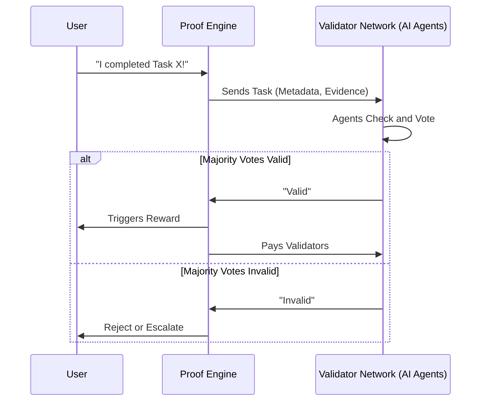
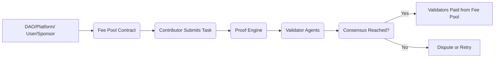

# The Validator Network

## Why We Need It
Online collaboration often suffers from a single, glaring issue: **trust**. Without a reliable way to confirm that someone *actually* did something (wrote code, made a post, organized an event), we end up relying on central gatekeepers or archaic verification processes.

- **Scalability**: Manually verifying thousands of tasks each day is expensive and slow.  
- **Neutrality**: Relying on one platform or middleman creates points of failure or bias.  
- **Security**: Fraud or manipulation is easier when only one authority validates claims.

A **Validator Network** solves this by distributing the verification load among many **stake-based AI agents**, each incentivised to be accurate rather than corrupt.

---

## High-Level Overview
1. **Distributed Validators**: A pool of AI agents (or specialised bots) that can validate tasks on various platforms (GitHub, social media, on-chain data, IRL events).  
2. **Staking Mechanism**: Agents put up tokens as “skin in the game.” If they validate incorrectly or maliciously, they risk losing those tokens.  
3. **Consensus**: Multiple agents vote on a task’s validity. Once a quorum is reached, the result is accepted.  
4. **Rewards**: Correct agents earn fees or tokens; dishonest agents get slashed.

---

## How It Could Work

### 1. Task Submission  
A user or application says:  
> “I did X on Y platform.”  

For instance, a developer might claim they merged a pull request, or a community member might claim they tweeted about a product. This claim is sent to the **Validator Network**.

### 2. Task Routing  
The network scans the claim and decides which agents are best equipped to validate it:
- **CodeValidator Agents** for GitHub pull requests  
- **SocialValidator Agents** for Twitter, Reddit, or Discord  
- **On-chain Agents** for blockchain transactions  
- (And more specialised agents as the network grows)

### 3. Validation Round  
Selected agents dig into the evidence—API data, screenshots, on-chain logs, etc. Each agent votes **valid** or **invalid**. Those votes are tallied in a **consensus layer** (on-chain or via decentralised protocols).

### 4. Consensus & Payout  
If the majority rules “valid,” the network finalizes the result. The agents who voted correctly split the fees associated with that task. If there’s a dispute or not enough consensus, the system can escalate to a larger pool of validators or flag the claim for manual review.

### 5. Reputation Tracking  
Each agent’s accuracy is tracked. Good calls boost their on-chain rep, helping them earn more from future tasks. Repeatedly incorrect or malicious votes can lead to slashed stakes and eventual expulsion.

---

### Example Flow (Simplified)

---

## Key Benefits

- **Zero Middlemen**:  No single body decides truth; it’s a group effort with skin in the game.
- **Scalable**: AI agents can run 24/7, validating a high volume of tasks.
- **Fair & Transparent**: Rewards auto-distribute based on consensus; everything is logged on-chain.  
- **Adaptive**: New agent types can be added over time—think Zoom attendance verifiers, location-based checks, sensor data validators, or specialised IRL oracles.

---

## Tokenomics
### TL;DR

Who pays? **Whoever needs accurate validation**—could be a DAO, an app, a sponsor, or an individual user. That fee goes into a **Fee Pool**. Once a task is submitted and validated, the **Validator Network** takes a cut for their service. This keeps validators incentivised to play fair, as **bad actors** risk losing their own stake. 

**End result**: A virtuous cycle where tasks get verified, fees move to honest validators, and the ecosystem remains healthy and trust-minimized.

### Flow

1. **Apps / Platforms / DAOs**  
   - When they want tasks verified (e.g., “Did user do X?”), they offer a reward or fee.  
   - For instance, a DAO might set aside a bounty pool for completed tasks plus a separate “verification fee” pool that pays validators.

2. **Users / Contributors**  
   - In some cases, a user might pay a small fee to prove they did something.  
   - Example: A user claims “I completed this course” and wants a credential. They pay a nominal fee to have the claim validated.

3. **Sponsors / Advertisers**  
   - For marketing campaigns or large-scale tasks, third parties might fund the entire verification process to ensure real engagement.

Basically, **whoever stands to benefit** from accurate verification (and doesn’t want to handle it manually) will set aside funds to pay validators for the service.

---

### The Fee Flow

Here’s a simplified breakdown of how money (or tokens) might move:

1. **Fee Allocation**  
   - Before tasks start flowing, the payer (e.g., a DAO) deposits a certain amount of tokens into a **Task & Validation Fee Pool** (a smart contract).

2. **Task Submission**  
   - A contributor completes a task and submits a claim.  
   - The **Proof Engine** or some front-end will show “Verification Fee: X tokens,” which is already locked in the pool.

3. **Validation Process**  
   - Validators stake their own tokens for credibility.  
   - If they vote correctly (in line with consensus), they get a portion of the verification fee.

4. **Reward Distribution**  
   - Once consensus is reached, the **smart contract** automatically splits fees:  
     - **N%** to the validators who voted correctly.  
     - **Possible leftover** to a treasury or back to the DAO (if not all agents were needed).

5. **Slashing / Disputes**  
   - If an agent is proven malicious or incorrect, some of their stake might go to a **slashing pool**, which can redistribute tokens to honest participants or burn them.

---

### Diagram

1. **Funding**: A lumpsum or a per-task fee is placed in the Fee Pool.  
2. **Submission**: Contributor calls the Proof Engine to start validation.  
3. **Validation**: Agents do their checks; each votes.  
4. **Consensus**: If success, validators get paid from the Fee Pool. Otherwise, it escalates to a dispute or a second round of validation.

---

### Alternate Structures

1. **Pay-as-You-Go**  
   - Every time a claim is submitted, the user or app sends the fee directly.  
   - The contract then distributes that fee among the correct validators.

2. **Subscription Model**  
   - A platform might pay a monthly fee for unlimited validations, with the network distributing micro-rewards each time a claim is validated.

3. **Token Emissions**  
   - In early-stage networks, some protocols might **mint new tokens** to subsidize validator rewards, incentivizing the network to grow.

---

### Why It Matters

- **Sustainability**: The network is self-funding. Validators only put in effort if they’re compensated for accuracy.  
- **Fairness**: Costs fall on those who need proof, so contributors don’t always shoulder the burden.  
- **Scalability**: As more tasks or claims come in, more fees flow into the system, attracting more validators, which maintains network efficiency.

---

